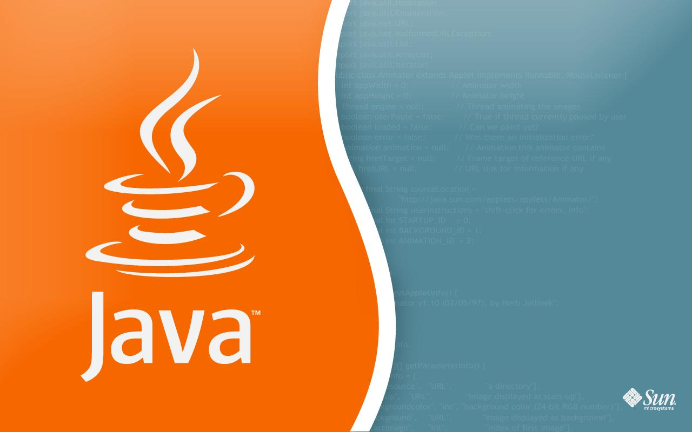

# Placement Preparation Repository

## Cheat Sheets

  

Cheat sheets for syntax and concepts in various progrmaming languages

## Data Structures and Algorithms (DSA) in C++

  

  Contains my solutions to various practice/contest problems from -> 
  
  - [CodeChef](https://www.codechef.com)
  - [CodeForces](https://codeforces.com)
  - [GFG (GeeksForGeeks)](https://www.geeksforgeeks.org)
  - [InterviewBit](https://www.interviewbit.com/practice/)
  - [LeetCode](https://leetcode.com)

## Object Oriented Programming (OOP) in Java and C++

  

 
  Contains my solutions to practice problems for OOP in Java

## Database Management Systems (DBMS) in SQL

  
 

 
  Contains my solutions to practice problems for DBMS in SQL
